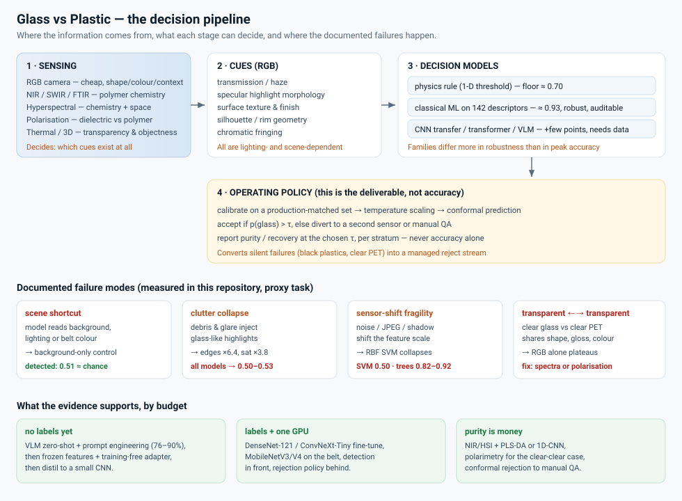

# Study index — separating glass from plastic with vision and sensors

A structured study of the algorithms, models and sensors that can decide whether an object is
**glass** or **plastic**, with an emphasis on the honest question: *can this be done from an RGB
image at all, and when do you need a different physical measurement?*

> **Two kinds of number live in this repository, and they never mix.**
> **Cited** numbers come from the papers in [`12_references.md`](12_references.md) and describe real
> datasets. **Measured** numbers come from this repository's synthetic proxy renderer and describe
> *method behaviour*, not real-world accuracy. Every table in this study says which it is.



## Read by role

| You are… | Read |
|---|---|
| **An engineer who must deploy something** | [11 Recommendations](11_recommendations.md) → [6 Model comparison](06_model_comparison.md) → [10 Deployment](10_deployment.md) |
| **A researcher writing a paper** | [1 Problem definition](01_problem_definition.md) → [9 Evaluation protocol](09_evaluation_protocol.md) → [3 Datasets](03_datasets_and_benchmarks.md) → [11 §11.5 Open problems](11_recommendations.md) |
| **Trying to understand the physics** | [2 Physics and cues](02_physics_and_cues.md) → [7 Beyond RGB](07_beyond_rgb.md) |
| **Choosing a model today** | `results/model_comparison.html` (interactive, re-weightable) → [5 Deep-learning zoo](05_deep_learning_zoo.md) |
| **Auditing somebody's accuracy claim** | [9 §9.3 Leakage controls](09_evaluation_protocol.md) → `results/MEASURED_RESULTS.md` §3 |

## Chapters

1. **[Problem definition](01_problem_definition.md)** — six different problems hiding inside
   "differentiate glass and plastic", scope, formal statement, acceptance criteria.
2. **[Physics and cues](02_physics_and_cues.md)** — the five RGB cue families, what physically
   separates the materials, and why the human solution needs motion.
3. **[Datasets and benchmarks](03_datasets_and_benchmarks.md)** — TrashNet, RealWaste, ZeroWaste,
   TACO and friends; what their numbers really say; how to build the benchmark that does not exist
   yet.
4. **[Classical pipelines](04_classical_pipelines.md)** — 142 hand-crafted descriptors, ten shallow
   models, the physics floor, and three measured failure modes.
5. **[Deep-learning zoo](05_deep_learning_zoo.md)** — from-scratch CNNs, transfer learning,
   transformers, attention hybrids, foundation models; what actually moves the number.
6. **[Model comparison](06_model_comparison.md)** — *generated*: 38 options scored on ten criteria
   with four weighting profiles, with the evidence for each. **Start here if you want the table.**
7. **[Beyond RGB](07_beyond_rgb.md)** — NIR/SWIR/FTIR, hyperspectral imaging, polarimetry, thermal,
   3D; the numbers and the fusion results.
8. **[Foundation models and VLMs](08_foundation_models_and_vlm.md)** — zero-shot, prompt engineering,
   training-free adapters, and where they fail.
9. **[Evaluation protocol](09_evaluation_protocol.md)** — how to produce a number that survives
   scrutiny, including a power analysis that explains why most ablation claims in this field are
   unfalsifiable.
10. **[Deployment](10_deployment.md)** — latency budgets, hardware tiers, optics, operating
    points, drift monitoring, failure-mode playbook.
11. **[Recommendations](11_recommendations.md)** — seven conclusions, a decision guide, a 90-day
    plan, and the open problems.
12. **[References](12_references.md)** — 45 numbered sources, cited as `[Rn]` everywhere.

## Generated artefacts

| File | What it is |
|---|---|
| `docs/06_model_comparison.md` | the full comparison, regenerated from the data files |
| `results/model_comparison.html` | self-contained interactive version (sort, filter, re-weight the criteria) |
| `results/MEASURED_RESULTS.md` | every number this repository measured, with its caveats |
| `results/*.csv` | raw outputs: model comparison, feature/cue ablations, shift robustness, controls, rules |
| `results/model_ranking.csv` | composite scores for all 38 options under all four profiles |
| `data/model_registry.csv` | the source of truth for architecture facts and cited evidence |
| `data/model_scores.csv` | the ten criteria, scored 1–5, per option |

## Quickstart

```bash
pip install -r requirements.txt

make proxy        # render the synthetic proxy dataset (~10 s)
make classical    # classical tier: models, rules, controls, shift sweep (~2 min)
make cues         # cue ablation with confidence intervals (~3 min)
make report       # regenerate docs/06 + results/model_comparison.html

make test         # unit + end-to-end smoke tests, incl. the leakage controls
```

Deep tier (optional, needs PyTorch):

```bash
pip install -r requirements-deep.txt
python -m gvp.cli deep  --model tv:resnet18 --epochs 20 --splits test,shift_clutter
python -m gvp.cli bench --models tv:resnet18,tv:mobilenet_v3_large,tv:convnext_tiny
```

## One-paragraph summary of the study

On the benchmarks that the field uses, almost every model works (90–99.6%), because those
benchmarks are studio-lit, single-object and saturated — and even there, the glass class is the
recurring exception. Binary glass-vs-plastic removes the easy context and keeps the hard boundary:
two transparent, shiny, similarly shaped materials whose governing difference is chemical. RGB
models can get far on proxy structure, but their accuracy is carried by texture, highlight
morphology and scene context, and it collapses under background clutter and acquisition shift;
the classical tier is *more* shift-robust than an RBF SVM and far cheaper, which is why it stays on
the short list. The configurations with published success on transparent-vs-transparent are
spectral (NIR/FTIR/HSI, F1 0.98–1.00 for polymer ID) or polarimetric, and the correct engineering
move is to add a sensor and a calibrated rejection policy rather than a bigger network. Pick an
architecture on robustness, cost and evidence quality — ConvNeXt-Tiny for accuracy-per-effort,
MobileNetV3/V4 for the edge, DenseNet-121 for comparability, a frozen foundation model with a
training-free adapter when you have no labels — and spend the rest of the budget on data,
stratification and controls.
