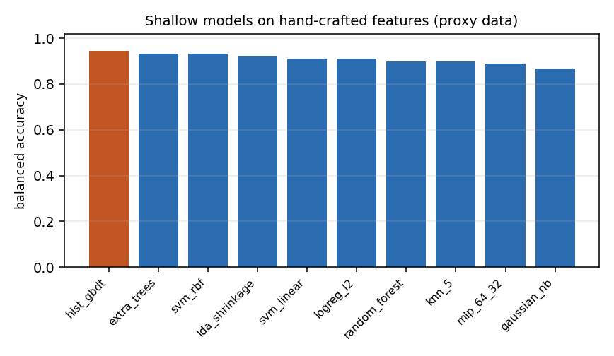
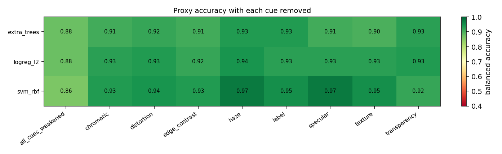
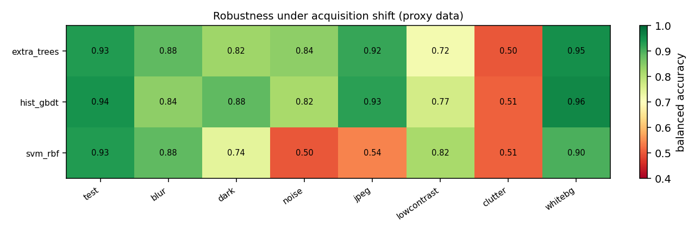
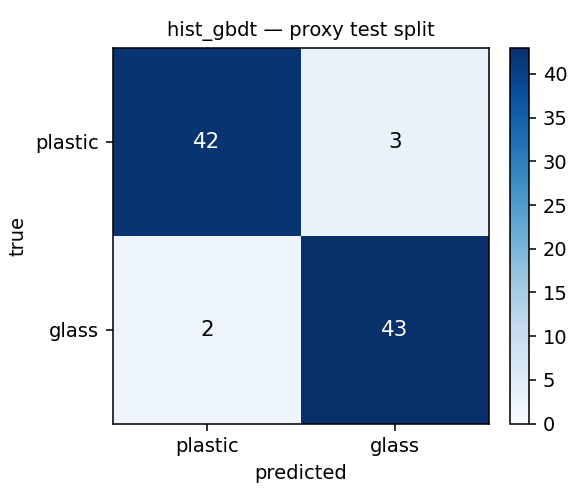
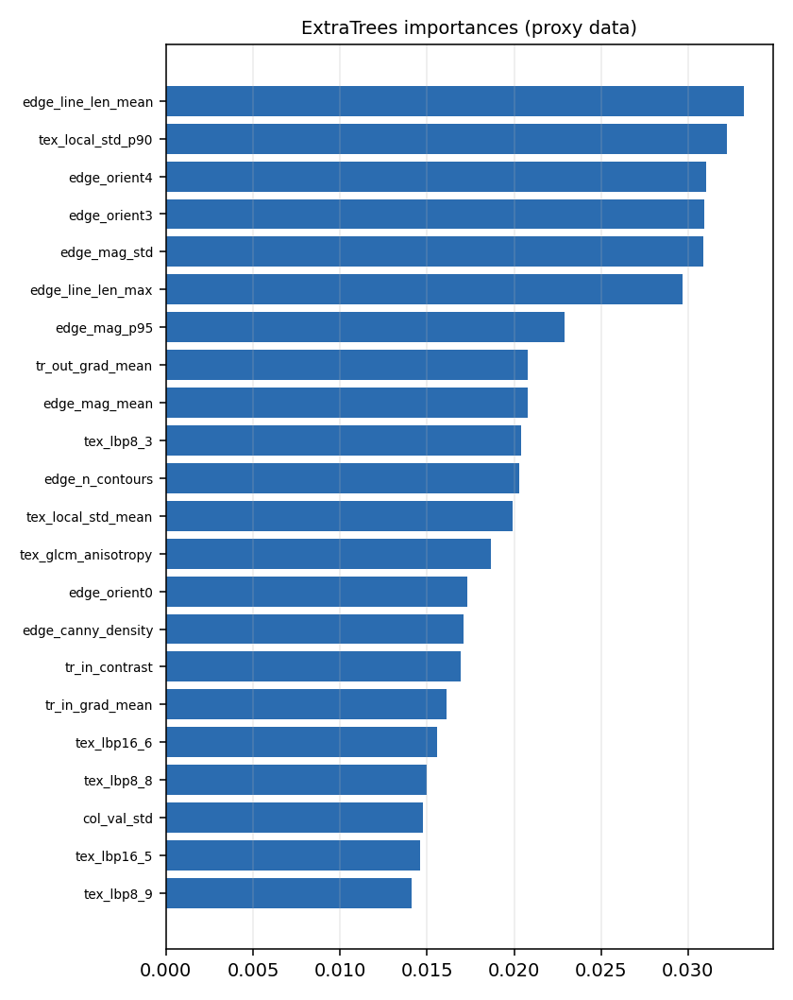

# Measured results (synthetic proxy task)

> ⚠️ **Proxy-data caveat.** Numbers produced by the built-in synthetic renderer measure method behaviour on a *simulated* cue structure, not real-world glass/plastic accuracy. See `docs/03_datasets_and_benchmarks.md` for real-data benchmarks and `docs/09_evaluation_protocol.md` for the protocol to reproduce this on TrashNet/RealWaste.


Everything on this page was produced by this repository on the **synthetic proxy dataset** (`gvp.synth`, 600 images at 128×128, 70/15/15 split, plus 7 shifted test sets). It is a test of *method behaviour* — which model classes are robust, what the failure modes look like, how much a cue ablation can resolve — with the object/cue structure of the renderer, not of reality. Do not quote these as glass/plastic accuracy.


Reproduce with:
```bash
make proxy        # generate data
make classical    # models, ablations, shifts, controls
make cues         # cue ablation
make report
```


## 1. Shallow models on 141 hand-crafted features


Trained on 420 proxy images, evaluated on 90 held-out images (in-distribution). Balanced accuracy with a 95% percentile bootstrap CI; the CI is wide because n=90.

| model | bal acc | 95% CI | accuracy | macro F1 | glass recall | plastic recall | ROC AUC | fit (s) | clf (ms/img) | size (kB) |
| --- | --- | --- | --- | --- | --- | --- | --- | --- | --- | --- |
| hist_gbdt | 0.9444 | 0.896–0.988 | 0.9444 | 0.9444 | 0.9556 | 0.9333 | 0.9862 | 0.9600 | 0.0455 | 702.3000 |
| svm_rbf | 0.9333 | 0.886–0.977 | 0.9333 | 0.9333 | 0.9111 | 0.9556 | 0.9847 | 0.0100 | 0.0313 | 199.1000 |
| extra_trees | 0.9333 | 0.874–0.978 | 0.9333 | 0.9333 | 0.9111 | 0.9556 | 0.9862 | 0.6600 | 1.1739 | 7050.2000 |
| lda_shrinkage | 0.9222 | 0.872–0.974 | 0.9222 | 0.9221 | 0.8889 | 0.9556 | 0.9832 | 0.0100 | 0.0045 | 165.3000 |
| svm_linear | 0.9111 | 0.853–0.961 | 0.9111 | 0.9109 | 0.8667 | 0.9556 | 0.9753 | 0.0100 | 0.0044 | 5.4000 |
| logreg_l2 | 0.9111 | 0.858–0.962 | 0.9111 | 0.9107 | 0.8444 | 0.9778 | 0.9837 | 0.0100 | 0.0041 | 5.5000 |
| knn_5 | 0.9000 | 0.836–0.957 | 0.9000 | 0.8999 | 0.9333 | 0.8667 | 0.9748 | 0.0000 | 0.0191 | 473.6000 |
| random_forest | 0.9000 | 0.830–0.955 | 0.9000 | 0.8999 | 0.8667 | 0.9333 | 0.9793 | 0.7900 | 0.7110 | 1642.8000 |
| mlp_64_32 | 0.8889 | 0.822–0.945 | 0.8889 | 0.8888 | 0.9111 | 0.8667 | 0.9388 | 0.0400 | 0.0065 | 275.4000 |
| gaussian_nb | 0.8667 | 0.799–0.933 | 0.8667 | 0.8666 | 0.8889 | 0.8444 | 0.9395 | 0.0000 | 0.0061 | 8.7000 |




**Reading.** Gradient boosting (0.944) and SVM-RBF (0.933) lead; Gaussian NB is last (0.867). Feature extraction costs ~18 ms/image on 1 CPU core, so the classifier latency (0.004–1.2 ms) is irrelevant next to the descriptor cost — the practical argument for a learned end-to-end model at high line speed, and against it at low volume.


## 2. Single-feature physics rules (the floor a learned model must beat)

| rule | bal acc | glass recall | plastic recall |
| --- | --- | --- | --- |
| high_spec_peak_spikiness | 0.7000 | 0.6889 | 0.7111 |
| low_spec_saturated_frac | 0.5000 | 0.0000 | 1.0000 |
| high_tr_haze_index | 0.5778 | 0.6000 | 0.5556 |
| low_tex_lap_var_inside | 0.5333 | 0.5333 | 0.5333 |

**Reading.** One threshold on highlight spikiness reaches 0.70 balanced accuracy. Any learned model that cannot clearly beat 1-D physics on your data is not earning its complexity.


## 3. Controls: is the number trustworthy?

| control | model | bal acc | expected | what it tests |
| --- | --- | --- | --- | --- |
| shuffled_labels | svm_rbf | 0.5111 | ≈0.50 (leak if > 0.55) | control: no label information should be learnable |
| shuffled_labels | extra_trees | 0.4778 | ≈0.50 (leak if > 0.55) | control: no label information should be learnable |
| background_only_cover50 | svm_rbf | 0.7222 | ≈0.50 (scene shortcut if > 0.60) | central 50% blanked; small windows leave peripheral object pixels visible |
| background_only_cover50 | extra_trees | 0.7778 | ≈0.50 (scene shortcut if > 0.60) | central 50% blanked; small windows leave peripheral object pixels visible |
| background_only_cover80 | svm_rbf | 0.5111 | ≈0.50 (scene shortcut if > 0.60) | central 80% blanked; small windows leave peripheral object pixels visible |
| background_only_cover80 | extra_trees | 0.5222 | ≈0.50 (scene shortcut if > 0.60) | central 80% blanked; small windows leave peripheral object pixels visible |

**Reading.** Shuffled labels recover chance (0.48–0.51) → no split leakage. The background-only control scores 0.72–0.78 when only the central 50% is blanked and falls to 0.51–0.52 when the central 80% is blanked: the earlier score came from peripherally visible *object* pixels (bottle necks, caps, shard tips), not from a scene shortcut. This sensitivity to the control's window size is itself the lesson — a background control that is too small will make a clean dataset look leaked.


## 4. Which feature blocks carry the signal?

| model | all | all_minus_color | all_minus_edge | all_minus_specular | all_minus_texture | all_minus_transparency | color | edge | specular | texture | transparency |
| --- | --- | --- | --- | --- | --- | --- | --- | --- | --- | --- | --- |
| extra_trees | 0.9333 | 0.9222 | 0.9111 | 0.9333 | 0.9000 | 0.9333 | 0.8889 | 0.8556 | 0.6778 | 0.9111 | 0.8667 |
| logreg_l2 | 0.9111 | 0.9222 | 0.9333 | 0.9222 | 0.9000 | 0.9111 | 0.8889 | 0.8333 | 0.6889 | 0.9444 | 0.8111 |
| svm_rbf | 0.9333 | 0.9333 | 0.9444 | 0.9333 | 0.9222 | 0.9444 | 0.8444 | 0.8222 | 0.7111 | 0.9333 | 0.8333 |

**Reading.** No single block is sufficient and no single block is required: `all` ≈ `all_minus_X` for every X, with differences inside the CI. Textured blocks (texture/edge) carry more than colour, consistent with the physical cue structure (finish and through-object detail, not hue).


## 5. Cue ablation: what is the model actually looking at?

| cue removed | mean Δ bal acc | models | 95% CI width (per model) |
| --- | --- | --- | --- |
| all_cues_weakened | -0.0583 | 3 | 0.1219 |
| edge_contrast | -0.0083 | 3 | 0.1010 |
| chromatic | -0.0056 | 3 | 0.0963 |
| texture | -0.0028 | 3 | 0.1046 |
| transparency | -0.0028 | 3 | 0.1005 |
| distortion | 0.0028 | 3 | 0.0873 |
| specular | 0.0083 | 3 | 0.0933 |
| label | 0.0083 | 3 | 0.0923 |
| haze | 0.0222 | 3 | 0.0915 |




**Reading — and a negative result.** With 120 test items per condition the 95% CI on a single accuracy is 0.09–0.12 wide. The largest single-cue effect on any single cue was 0.022, and 100% of single-cue effects are smaller than the *narrowest* CI in the experiment. This design therefore **cannot** conclude that any individual cue is load-bearing: the proxy task is cue-redundant and the experiment is underpowered. Only removing *all* cues at once produces a consistent drop, and even that sits inside the CI. Reporting 'cue X matters' from deltas of this size would be p-hacking. The honest statement is the one above, plus this: a study that wants to rank cue importance needs a factorial design with ≥1,000 test items per cell, or a dose-response design with graded cue strengths (the `CueStrength` knob supports both — only the sample size is missing).


## 6. Robustness under acquisition shift


Trained on clean in-distribution data, tested on fresh scenes with one degradation each. Δ is relative to the clean test split.

| model | test | noise | clutter | jpeg | lowcontrast | dark | blur | whitebg |
| --- | --- | --- | --- | --- | --- | --- | --- | --- |
| extra_trees | 0.9333 | 0.8417 | 0.5000 | 0.9167 | 0.7167 | 0.8250 | 0.8833 | 0.9500 |
| hist_gbdt | 0.9444 | 0.8167 | 0.5083 | 0.9250 | 0.7667 | 0.8833 | 0.8417 | 0.9583 |
| svm_rbf | 0.9333 | 0.5000 | 0.5083 | 0.5417 | 0.8167 | 0.7417 | 0.8833 | 0.9000 |




**Reading.** Three distinct failure signatures, and they are the most transferable findings of this whole exercise:


1. **Model-family robustness to pixel-level degradation differs enormously.** Extra-trees hold 0.82–0.92 under sensor noise, JPEG artefacts and deep shadow; an RBF SVM on the same features collapses to 0.50–0.54 (its standardisation and kernel geometry do not survive the shift). If you deploy a classical pipeline, prefer tree ensembles, and always test under the degradations your camera actually produces.
2. **Background clutter breaks every global-descriptor model** (all three fall to 0.50–0.53). Diagnostics: Canny edge density rises 6.4×, the fraction of saturated pixels 3.8×, and `edge_mag_p95` 4.1× — debris and glare inject glass-like highlight statistics everywhere. The fix is architectural, not a better classifier: a detection/segmentation stage (or an attention/detector-prior CNN) that restricts the features to the object.
3. **Removing the background context does *not* hurt** (the `whitebg` condition scores 0.90–0.96, slightly *better* than clean). This is evidence that the model is not relying on transmitted-background cues in this renderer — and it is exactly the kind of assumption that a white-studio benchmark (e.g. TrashNet) silently validates and a real conveyor violates.


## 7. Figures








## 8. Known limitations of this measurement


* **Synthetic proxy data.** The renderer encodes the cue structure the literature describes; it
  cannot reproduce real material appearance, contamination, or camera physics. Absolute numbers
  are meaningless; *relative* model behaviour and failure modes are the useful output.
* **Small test sets.** n=90 (in-distribution) and n=120 (shifted). CIs of ±0.05–0.10 mean only
  large effects are resolvable. `docs/09_evaluation_protocol.md` specifies what a real study needs.
* **One feature extractor, one hyper-parameter set, one seed.** No seed averaging was performed
  for the classical tier (the deep tier supports `--seed`). Multi-seed runs are a `make sweep`
  target and are *required* before reporting deltas of a few points.
* **Hand-tuned object-region estimator.** The transparency features depend on
  `gvp.features.estimate_foreground`, whose failure under clutter is documented above; an
  oracle-mask control would separate 'descriptor failure' from 'segmentation failure' and is
  listed as future work.
* **The cue-ablation design is underpowered** (see §5) and uses a single ablation level rather
  than a dose-response curve.
