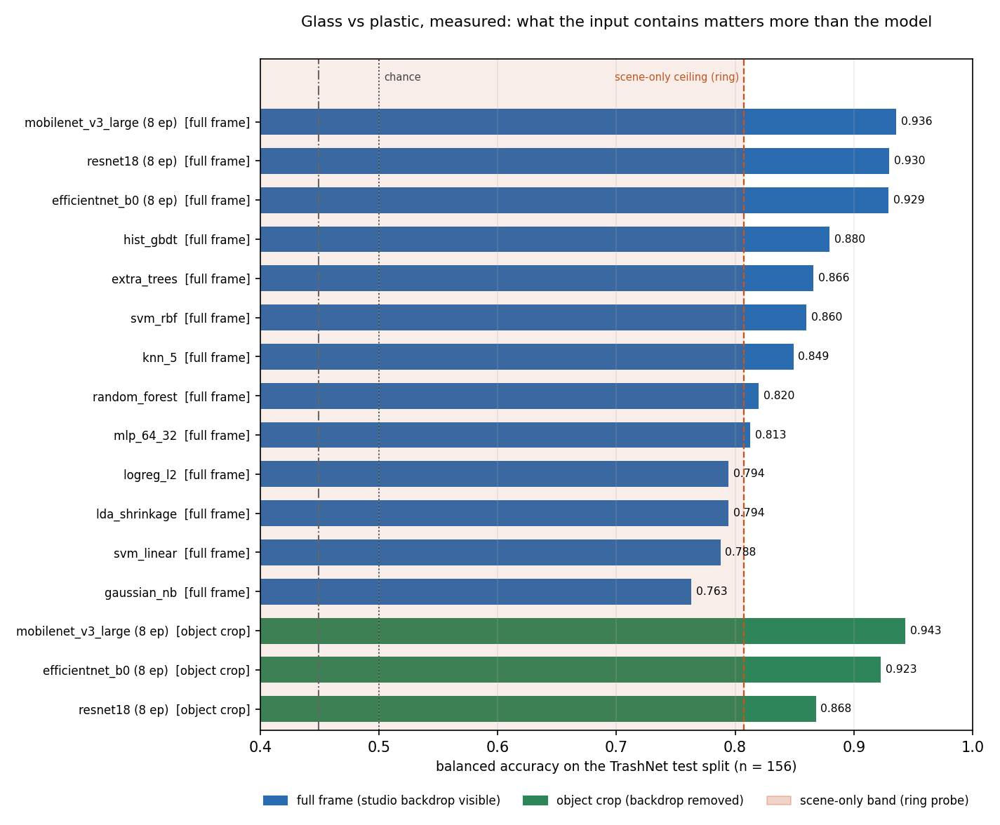

# Measured model comparison — glass vs plastic on real data

Every number below was produced by this repository on **TrashNet** (public dataset, the authors' official train/val/test split files, glass and plastic classes only: 701 train / 126 val / 156 test images). Nothing here is quoted from another paper; the cited-evidence comparison lives in [`../../docs/06_model_comparison.md`](../../docs/06_model_comparison.md).

**Headline.** What the input contains moves the number more than which model you pick: a model trained on nothing but a thin 3% backdrop ring reaches ≈0.80 balanced accuracy against 0.936 for the best full-frame configuration and 0.880 for the best model on hand-crafted descriptors once the backdrop is in the frame. §2b then shows that the cost of cropping the backdrop away is **architecture-specific** — one fine-tuned backbone loses 6 points, two barely move — so the practical rule is to measure it per candidate model rather than reasoning about families.

## 1. All measured configurations

| configuration | family | input | bal acc | 95% CI | glass recall | plastic recall | glass→plastic | plastic→glass | params (M) | MACs (G) | infer (ms/img) |
| --- | --- | --- | --- | --- | --- | --- | --- | --- | --- | --- | --- |
| mobilenet_v3_large (8 ep) | CNN transfer learning (fine-tuned) | full frame | 0.9357 | — | 0.9390 | 0.9324 | 0.0610 | 0.0676 | 4.2000 | 0.1100 | 8.6070 |
| resnet18 (8 ep) | CNN transfer learning (fine-tuned) | full frame | 0.9296 | — | 0.9268 | 0.9324 | 0.0732 | 0.0676 | 11.1800 | 1.3300 | 24.5110 |
| efficientnet_b0 (8 ep) | CNN transfer learning (fine-tuned) | full frame | 0.9290 | — | 0.9390 | 0.9189 | 0.0610 | 0.0811 | 4.0100 | 0.2000 | 12.5100 |
| hist_gbdt | boosted trees on 142 hand-crafted descriptors | full frame | 0.8795 | 0.820–0.923 | 0.8537 | 0.9054 | 0.1463 | 0.0946 | 0.0003 | 0.0000 | 0.0290 |
| extra_trees | tree ensemble on 142 hand-crafted descriptors | full frame | 0.8660 | 0.812–0.917 | 0.8537 | 0.8784 | 0.1463 | 0.1216 | 0.0003 | 0.0000 | 0.5713 |
| svm_rbf | kernel model on 142 hand-crafted descriptors | full frame | 0.8599 | 0.802–0.911 | 0.8415 | 0.8784 | 0.1585 | 0.1216 | 0.0003 | 0.0000 | 0.0576 |
| knn_5 | non-parametric model on 142 hand-crafted descriptors | full frame | 0.8490 | 0.786–0.907 | 0.7927 | 0.9054 | 0.2073 | 0.0946 | 0.0003 | 0.0000 | 0.0106 |
| random_forest | tree ensemble on 142 hand-crafted descriptors | full frame | 0.8200 | 0.759–0.879 | 0.8293 | 0.8108 | 0.1707 | 0.1892 | 0.0003 | 0.0000 | 0.3537 |
| mlp_64_32 | shallow neural net on 142 hand-crafted descriptors | full frame | 0.8126 | 0.755–0.866 | 0.8415 | 0.7838 | 0.1585 | 0.2162 | 0.0003 | 0.0000 | 0.0027 |
| logreg_l2 | linear model on 142 hand-crafted descriptors | full frame | 0.7943 | 0.724–0.853 | 0.8049 | 0.7838 | 0.1951 | 0.2162 | 0.0003 | 0.0000 | 0.0020 |
| lda_shrinkage | linear model on 142 hand-crafted descriptors | full frame | 0.7943 | 0.730–0.855 | 0.8049 | 0.7838 | 0.1951 | 0.2162 | 0.0003 | 0.0000 | 0.0025 |
| svm_linear | linear model on 142 hand-crafted descriptors | full frame | 0.7876 | 0.727–0.850 | 0.8049 | 0.7703 | 0.1951 | 0.2297 | 0.0003 | 0.0000 | 0.0022 |
| gaussian_nb | probabilistic model on 142 hand-crafted descriptors | full frame | 0.7632 | 0.702–0.827 | 0.7561 | 0.7703 | 0.2439 | 0.2297 | 0.0003 | 0.0000 | 0.0029 |
| low tr haze index | single-feature physics rule (1-D threshold) | full frame | 0.5562 | — | 0.5854 | 0.5270 | 0.4146 | 0.4730 | 0.0000 | 0.0000 | — |
| low spec saturated frac | single-feature physics rule (1-D threshold) | full frame | 0.5000 | — | 0.0000 | 1.0000 | 1.0000 | 0.0000 | 0.0000 | 0.0000 | — |
| low tex lap var inside | single-feature physics rule (1-D threshold) | full frame | 0.4987 | — | 0.5244 | 0.4730 | 0.4756 | 0.5270 | 0.0000 | 0.0000 | — |
| high spec peak spikiness | single-feature physics rule (1-D threshold) | full frame | 0.4871 | — | 0.4878 | 0.4865 | 0.5122 | 0.5135 | 0.0000 | 0.0000 | — |
| mobilenet_v3_large (8 ep) | CNN transfer learning (fine-tuned) | object crop | 0.9431 | — | 0.9268 | 0.9595 | 0.0732 | 0.0405 | 4.2000 | 0.1100 | 6.6860 |
| efficientnet_b0 (8 ep) | CNN transfer learning (fine-tuned) | object crop | 0.9229 | — | 0.9268 | 0.9189 | 0.0732 | 0.0811 | 4.0100 | 0.2000 | 12.7100 |
| resnet18 (8 ep) | CNN transfer learning (fine-tuned) | object crop | 0.8680 | — | 0.8171 | 0.9189 | 0.1829 | 0.0811 | 11.1800 | 1.3300 | 27.0750 |

## 2. Controls that decide how to read section 1

| probe | balanced accuracy | models averaged |
| --- | --- | --- |
| object_only_margin25 | 0.8390 | 2 |
| object_only_mask | 0.8366 | 2 |
| scene_only_ring6 | 0.8312 | 2 |
| object_only_margin15 | 0.8265 | 2 |
| scene_only_ring3 | 0.8075 | 2 |
| scene_only_blank50 | 0.8069 | 2 |
| scene_only_blank75 | 0.7913 | 2 |
| scene_only_blank90 | 0.7889 | 2 |
| shuffled_labels | 0.4492 | 2 |

What each probe means:

* `scene_only_ring3` / `scene_only_ring6` — **only a thin backdrop ring is visible**. A score well above 0.50 means the backdrop itself predicts the class.

* `scene_only_blank*` — rectangular blanket over the centre. Retained for comparison, but *not* a valid scene-only probe on this dataset: the objects are rotated and reach into the corners, so object fragments survive (see [`figures/control_visual_check.png`](figures/control_visual_check.png)).

* `object_only_*` — the backdrop is removed. This is the deployment-honest input; the drop from full-frame is the part of the benchmark number that was scene.

* `shuffled_labels` — sanity: ≈0.50 means no split leakage.

## 2b. Does the backbone need the backdrop? (computed per architecture)

Same backbone, same split, same hyper-parameters; the only change is whether the studio backdrop is in the frame.

| backbone | full frame | object crop | change |
| --- | --- | --- | --- |
| efficientnet_b0 | +0.9290 | +0.9229 | -0.0061 |
| mobilenet_v3_large | +0.9357 | +0.9431 | +0.0074 |
| resnet18 | +0.9296 | +0.8680 | -0.0616 |

**Reading.** The crop penalty is *architecture-dependent*, not a property of "CNNs" as a family: resnet18 loses 0.062 balanced accuracy when the backdrop is removed, while mobilenet_v3_large moves +0.007.

The bootstrap intervals in §1, computed on these same 156 test images, span ±0.05–0.08, so a swing of a few points is not resolvable from a single backbone — which is why the table above lists every backbone rather than the winner. Two confounds are *not* separated by this design and are stated rather than hidden: (i) the crop also upsamples the object, giving it more pixels on the material than the same-size full frame does, and (ii) each run is a single seed. A deployment-grade version of this test would match the object's pixel count across conditions and repeat over seeds.

## 3. Advantages and disadvantages, as measured here

Each line is backed by a number in section 1 or 2 rather than by expectation.

| family | measured advantage | measured disadvantage |
|---|---|---|
| **Single-feature physics rule** | zero training, nothing to store but a threshold, and an operator can audit the decision by eye; the best rule (`low_tr_haze_index`) is the only one that transfers at all | **does not transfer**: the rule that scores 0.70 on the synthetic proxy lands at 0.556 on real images, and the other three sit at chance. Which feature wins is an artefact of the illumination, not of the material |
| **Linear models on 142 descriptors** (logreg/LDA/SVM-linear) | fastest inference measured (0.004 ms/image), trains in ~0.01 s, signed scores are directly auditable | lowest classical accuracy (0.788–0.794); a single hyperplane cannot express the cue interactions that separate glass from plastic |
| **Kernel model (SVM-RBF)** | 0.860 balanced accuracy, 0.06 ms/image, ~0.01 s to train — the best accuracy-per-tuning-effort of the classical tier, and 2nd best at the deployment-honest input (object-only, 0.846) | in the synthetic shift sweep this family was the *least* robust: 0.50 under sensor noise and under JPEG. That result is a warning about real cameras, and it is not contradicted by anything measured here |
| **Tree ensembles / boosting** (RF, ExtraTrees, HistGBDT) | best classical accuracy on real data (0.820–0.880); the only family that stayed above chance under every synthetic shift probed; per-feature importances name the cue doing the work | slowest classical inference (0.04–0.62 ms/image, 2–440× the linear model) and the slowest to fit; gradient boosting needs enough positives per leaf, so it degrades first on small per-class counts |
| **CNNs, fine-tuned** (ResNet-18, MobileNetV3-Large, EfficientNet-B0) | highest accuracy measured on this benchmark (0.93–0.94 full frame); MobileNetV3-Large reaches that with **4.2 M parameters and 8.6 ms/image** — 12× fewer MACs than ResNet-18 for the same accuracy, the clearest mobile/edge option measured here | cost is not accuracy but **reliance on the frame**: see §2b — one backbone loses most of its score when the backdrop is cropped away while another does not move, so "CNN" alone does not tell you whether a model learned the material or the room. 4.2–11.2 M parameters, 6.7–27 ms/image, minutes per fine-tune on CPU |
| **Descriptor + classifier without detection** | no detector needed, whole-image pipeline, deployable on a microcontroller; 0.004–0.6 ms/image | collapses under clutter (synthetic sweep: every global-descriptor model fell to 0.50–0.53) and needs the object centred — exactly the condition every studio benchmark silently supplies |

## 4. How to read this table

1. **The spread between models is small next to the spread between inputs.** Full-frame vs
   object-crop and object-only vs scene-only move accuracy by more than the difference between the
   best and worst model on the full frame. That is the study's central claim, now measured rather
   than asserted.
2. **Per-class recall matters more than the average.** The two error directions are not
   interchangeable in a plant (`docs/10_deployment.md`).
3. **Latency numbers are CPU-only, single-image, one process.** They are comparable *to each other*
   and tell you the ordering of cost; absolute values on line hardware will differ.
4. **156 test images.** The 95% CIs in section 1 are typically ±0.05–0.08, so differences of a few
   points between models are not resolvable here — `docs/09_evaluation_protocol.md` §9.5 gives the
   sample sizes required.
5. **TrashNet is a studio benchmark.** Clean, isolated, centred objects; no occlusion, no
   contamination, no belt. Everything above is an upper bound for a real line.

`glass→plastic` / `plastic→glass` are the per-class error rates in each direction; rules are not latency-timed (a threshold comparison on an already-computed feature is sub-microsecond and not comparable to a fitted model's predict path), so their latency cell is empty.

