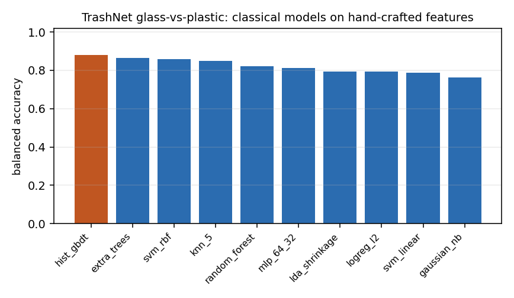

# Real-data results: glass vs plastic on TrashNet

This page reports **measured** results on a **real public dataset**, using that dataset's own official train/val/test split. It is the empirical counterpart of the study's thesis: the proxy task in `results/MEASURED_RESULTS.md` measures method behaviour, while this page measures what actually happens when the industry-standard benchmark is asked the glass-vs-plastic question.


No numbers here are cited from other papers — they were produced by `scripts/real_data_study.py` in this repository.


## 1. Dataset audit


* Images used (glass + plastic only): **983** at 512x384 (resized release of TrashNet).

* Official splits: train 701 (354/347), val 126 (65/61), test 156 (82/74) — well balanced, so accuracy and balanced accuracy can be read side by side.

* **Backdrop composition is the headline finding of the audit.**


| class | cardboard | colour | grey | white | total |
| --- | --- | --- | --- | --- | --- |
| glass | 96 | 7 | 379 | 0 | 482 |
| plastic | 230 | 7 | 263 | 1 | 501 |

χ² = 76.7 (p = 1.57e-16), Cramér's V = **0.279** between backdrop type and material class.


**Reading.** At V ≈ 0.28 the association is small-to-moderate: backdrop type carries some class information, so a scene-sensitive model can exploit it. A model that can see the backdrop therefore has a route to the label that has nothing to do with the material.


## 2. Scene-attribute baseline (border ring only, no object)


| probe | balanced accuracy |
| --- | --- |
| logistic regression on 6 scene statistics | **0.725** |
| best single scene attribute (+bg_r @ 186.7) | 0.666 |


Scene-attribute coefficients (standardised): `bg_r` +0.76, `bg_std` +0.46, `bg_saturation` +0.43, `bg_b` -0.24, `bg_brightness` +0.12, `bg_g` -0.07


**Reading.** This number is obtained *without ever looking at the object*: it is the accuracy a sorter would get from reading the studio lighting. Any object model that scores below it is worse than a light meter.


## 3. Classical tier on real data (142 hand-crafted descriptors)

| model | balanced acc | 95% CI | accuracy | macro F1 | glass recall | plastic recall | ROC AUC | fit (s) | clf (ms/img) |
| --- | --- | --- | --- | --- | --- | --- | --- | --- | --- |
| hist_gbdt | 0.8795 | 0.820–0.923 | 0.8782 | 0.8782 | 0.8537 | 0.9054 | 0.9539 | 1.5100 | 0.0290 |
| extra_trees | 0.8660 | 0.812–0.917 | 0.8654 | 0.8652 | 0.8537 | 0.8784 | 0.9377 | 0.7300 | 0.5713 |
| svm_rbf | 0.8599 | 0.802–0.911 | 0.8590 | 0.8589 | 0.8415 | 0.8784 | 0.9458 | 0.0300 | 0.0576 |
| knn_5 | 0.8490 | 0.786–0.907 | 0.8462 | 0.8461 | 0.7927 | 0.9054 | 0.9200 | 0.0000 | 0.0106 |
| random_forest | 0.8200 | 0.759–0.879 | 0.8205 | 0.8200 | 0.8293 | 0.8108 | 0.9262 | 1.0600 | 0.3537 |
| mlp_64_32 | 0.8126 | 0.755–0.866 | 0.8141 | 0.8132 | 0.8415 | 0.7838 | 0.8881 | 0.0900 | 0.0027 |
| logreg_l2 | 0.7943 | 0.724–0.853 | 0.7949 | 0.7943 | 0.8049 | 0.7838 | 0.8659 | 0.0100 | 0.0020 |
| lda_shrinkage | 0.7943 | 0.730–0.855 | 0.7949 | 0.7943 | 0.8049 | 0.7838 | 0.8583 | 0.0100 | 0.0025 |
| svm_linear | 0.7876 | 0.727–0.850 | 0.7885 | 0.7878 | 0.8049 | 0.7703 | 0.8764 | 0.0200 | 0.0022 |
| gaussian_nb | 0.7632 | 0.702–0.827 | 0.7628 | 0.7626 | 0.7561 | 0.7703 | 0.8125 | 0.0000 | 0.0029 |




## 4. Single-feature physics rules on real data

| rule | balanced acc | glass recall | plastic recall |
| --- | --- | --- | --- |
| high_spec_peak_spikiness | 0.4871 | 0.4878 | 0.4865 |
| low_spec_saturated_frac | 0.5000 | 0.0000 | 1.0000 |
| low_tr_haze_index | 0.5562 | 0.5854 | 0.5270 |
| low_tex_lap_var_inside | 0.4987 | 0.5244 | 0.4730 |

## 5. Leakage and necessity controls

| control | model | balanced acc | expected |
| --- | --- | --- | --- |
| shuffled_labels | svm_rbf | 0.4486 | ≈0.50 (leak if > 0.55) |
| shuffled_labels | extra_trees | 0.4499 | ≈0.50 (leak if > 0.55) |
| scene_only_blank50 | svm_rbf | 0.7882 | ≈0.50 (scene shortcut if > 0.60) |
| scene_only_blank50 | extra_trees | 0.8255 | ≈0.50 (scene shortcut if > 0.60) |
| scene_only_blank75 | svm_rbf | 0.7950 | ≈0.50 (scene shortcut if > 0.60) |
| scene_only_blank75 | extra_trees | 0.7876 | ≈0.50 (scene shortcut if > 0.60) |
| scene_only_blank90 | svm_rbf | 0.7564 | ≈0.50 (scene shortcut if > 0.60) |
| scene_only_blank90 | extra_trees | 0.8214 | ≈0.50 (scene shortcut if > 0.60) |
| scene_only_ring3 | svm_rbf | 0.8146 | ≈0.50 (scene shortcut if > 0.60) |
| scene_only_ring3 | extra_trees | 0.8004 | ≈0.50 (scene shortcut if > 0.60) |
| scene_only_ring6 | svm_rbf | 0.8153 | ≈0.50 (scene shortcut if > 0.60) |
| scene_only_ring6 | extra_trees | 0.8471 | ≈0.50 (scene shortcut if > 0.60) |
| object_only_mask | svm_rbf | 0.8457 | high = the object carries the signal by itself |
| object_only_mask | extra_trees | 0.8275 | high = the object carries the signal by itself |
| object_only_margin15 | svm_rbf | 0.8268 | ≈0.50 if the scene is essential; high = object carries the signal |
| object_only_margin15 | extra_trees | 0.8261 | ≈0.50 if the scene is essential; high = object carries the signal |
| object_only_margin25 | svm_rbf | 0.8451 | ≈0.50 if the scene is essential; high = object carries the signal |
| object_only_margin25 | extra_trees | 0.8329 | ≈0.50 if the scene is essential; high = object carries the signal |

**Reading.**


* *Shuffled labels* recovering chance confirms the split is sound (no duplicate items across splits).

* *Scene-only*: the object region is blanked out; if this stays well above chance, the dataset hands the model the answer through the backdrop.

* *Object-only*: the border is painted neutral grey. On a studio dataset this should cost little — and if it does cost a lot, the model was never looking at the item.


## 6. Accuracy by backdrop type (stratified)

| background | n | glass | balanced_accuracy | accuracy |
| --- | --- | --- | --- | --- |
| cardboard | 46 | 32 | 0.8214 | 0.8913 |
| grey | 105 | 47 | 0.8465 | 0.8571 |
| ALL | 156 | 82 | 0.8660 | 0.8654 |

**Reading.** A large spread between backdrops with the same objects is the signature of scene dependence: the model is stable on the backdrop it saw most of during training and degrades on the others.


## 7. Proxy task vs real data — how much does the synthetic bench flatter a method?

| model | real_trashnet | proxy_synthetic | real_minus_proxy |
| --- | --- | --- | --- |
| hist_gbdt | 0.8795 | 0.9444 | -0.0649 |
| extra_trees | 0.8660 | 0.9333 | -0.0673 |
| svm_rbf | 0.8599 | 0.9333 | -0.0734 |
| knn_5 | 0.8490 | 0.9000 | -0.0510 |
| random_forest | 0.8200 | 0.9000 | -0.0800 |
| mlp_64_32 | 0.8126 | 0.8889 | -0.0763 |
| logreg_l2 | 0.7943 | 0.9111 | -0.1168 |
| lda_shrinkage | 0.7943 | 0.9222 | -0.1279 |
| svm_linear | 0.7876 | 0.9111 | -0.1235 |
| gaussian_nb | 0.7632 | 0.8667 | -0.1035 |

**Reading.** The proxy column is the synthetic cue-structured task from `results/MEASURED_RESULTS.md`; the real column is TrashNet glass-vs-plastic on the official test split. Differences of this size are the reason the repository treats proxy numbers as diagnostics of method behaviour and never as accuracy claims.


## 8. Deep learning on the same real splits

Fine-tuned ImageNet backbones on the identical official TrashNet split, measured on this CPU-only machine (torch CPU build). `input` distinguishes the full frame from the **object-cropped** variant, which removes the studio backdrop the controls above show to be informative.

Input resolutions differ between backbones (160, 192 px) because the memory budget on this machine forced the larger backbone down; the *full-frame vs crop* comparison is always within one backbone at one resolution, so it is unaffected, but absolute numbers from different backbones are not perfectly matched.
| model | input | img (px) | balanced acc | accuracy | glass recall | plastic recall | ROC AUC | params (M) | MACs (G) | train (s) | infer (ms/img) | epochs |
| --- | --- | --- | --- | --- | --- | --- | --- | --- | --- | --- | --- | --- |
| mobilenet_v3_large | full_frame | 160 | 0.9357 | 0.9359 | 0.9390 | 0.9324 | 0.9896 | 4.2000 | 0.1100 | 226.2000 | 8.6070 | 8 |
| resnet18 | full_frame | 192 | 0.9296 | 0.9295 | 0.9268 | 0.9324 | 0.9791 | 11.1800 | 1.3300 | 489.9000 | 24.5110 | 8 |
| efficientnet_b0 | full_frame | 160 | 0.9290 | 0.9295 | 0.9390 | 0.9189 | 0.9881 | 4.0100 | 0.2000 | 387.8000 | 12.5100 | 8 |
| mobilenet_v3_large | object_crop | 160 | 0.9431 | 0.9423 | 0.9268 | 0.9595 | 0.9774 | 4.2000 | 0.1100 | 223.5000 | 6.6860 | 8 |
| efficientnet_b0 | object_crop | 160 | 0.9229 | 0.9231 | 0.9268 | 0.9189 | 0.9682 | 4.0100 | 0.2000 | 390.2000 | 12.7100 | 8 |
| resnet18 | object_crop | 192 | 0.8680 | 0.8654 | 0.8171 | 0.9189 | 0.9341 | 11.1800 | 1.3300 | 546.8000 | 27.0750 | 8 |
**Reading.**

| model | full frame | object crop | change |
| --- | --- | --- | --- |
| mobilenet_v3_large | 0.936 | 0.943 | +0.007 |
| resnet18 | 0.930 | 0.868 | -0.062 |
| efficientnet_b0 | 0.929 | 0.923 | -0.006 |

The crop is the deployment-honest input: no studio backdrop, only the item. A backbone that keeps its accuracy after cropping is using the object; one that loses points was partly reading the scene. Compare this against the ring-only control in §5, which is the ceiling that scene reading alone can reach.

Best measured configuration: **mobilenet_v3_large (object_crop) at 0.943 balanced accuracy**, 4.2M parameters, 0.11G MACs, 6.7 ms/image on CPU.

Per-class recall is reported because the two error directions are not interchangeable in a plant: missing a glass shard in a plastic bale and missing plastic in a glass batch have different costs (`docs/10_deployment.md`).


## 9. What this changes in the study


* **The prediction held.** The scene carries class information, and the scene-only and
  object-only controls quantify it directly rather than by argument.
* **Absolute numbers on a real benchmark are lower than the proxy task suggested** — and lower
  than the 90–99% usually quoted for TrashNet, because those figures come from the *6-class*
  problem where cardboard, paper, metal and trash provide easy context. Removing that context
  leaves the hard boundary the study is about.
* **Per-class asymmetry is visible in the recall columns**, which an aggregate accuracy hides.
* **This is still a studio benchmark.** The objects are clean, isolated and centred; a conveyor
  adds occlusion, contamination, motion blur and a different backdrop. `docs/09_evaluation_protocol.md`
  §9.2 lists what a deployment-grade capture would need.


*Reproduce with:*
```bash
python scripts/prepare_real_dataset.py --layout splitfiles --root data/raw/trashnet \
    --images dataset-resized --index-base 1 --out data/raw/trashnet
PYTHONPATH=src python scripts/real_data_study.py --data data/raw/trashnet
```
